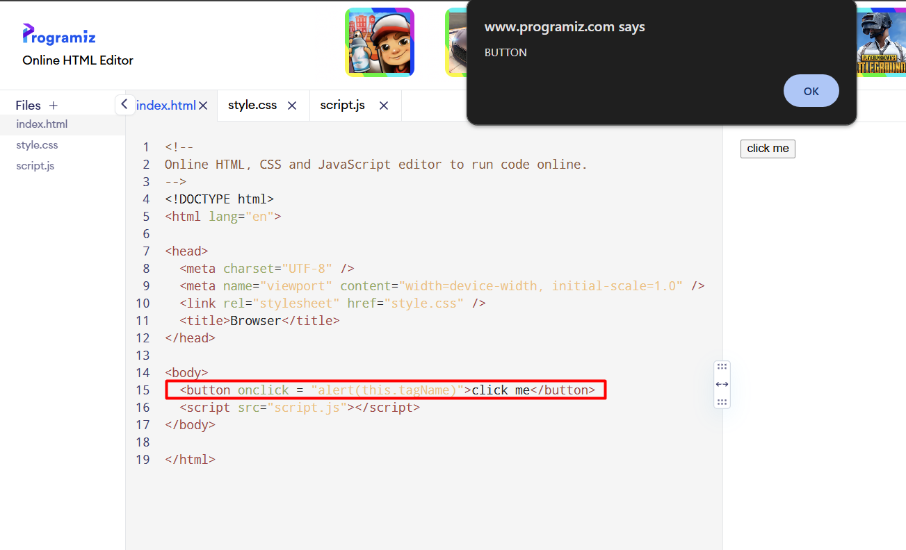

# JS Notes :-

JS is most popular and used language around the world.

# How JS Code works :-

Whenever any JS code starts run whole new Execution context will be created for that JS code.

- In Execution context their is two parts memory and code part.
- Memory part contains all the varibles and functions while code will provide an local envoirnment to run the piece of code.
- More important is that we have call stack which maintains the order of execution for our code.

```
var x = 2;

function print(x){
    console.log(x);
}

print(x);
```

- For above code once the program start running brand new execution context will be created with memory and code part. In memory variable x and function print will be stored.

- Most important thing is that at intially JS engine store undefine for varibles before executing the lines once it completed suppose x varible line is executed than undefined will be replaced with 2. undefined is just an placeholder for varibles or we can say that memory is allocated for the vaibles and functions will be stored as it is.

- once the program starts line by line varible x will be replaced from undefined to 2 and print(x) will be call once this function is called whole brand new execution context is going to create in code part of current executin context which present at the top stack with its own memory that store varibles and functions and code part that executes the print function code.

- call stack maintains the order of execution and first global execution context which will be created at start of program.

- once print function is completed then its execution context will be poped out from call stack and control again went to global execution context to finsh its execution.

- JS is Single threaded synchronous language it start execution of program line by line at time.

# Hoisting in JS :-

- Once the program start running even before it went to any line of code in program it stores all the varibles with undefined and function as it is.

- Once it finishes the exection of line for the particular varible its values will be replaced from undefined with intialized value.

- Undefined is just placedholder in memory that shows or indication memory is assigned for that varible with special keyword undefined which will be replaced in future once the program lines executions are completed.

- functions will be stored as it is with its code and intially but in case var it is stored as undefined.

- In case suppose if we try to access a varible name y that is not present in our program than it will print -- ReferenceError: y is not defined

```

console.log(x); // output is undefined
console.log(a); // output is function a() {
                                console.log("a");
                            }
cosole.log(y) // ReferenceError: y is not defined

var x = 2;

function a() {
    console.log("a");
}

console.log(x); // output is now 2
```

# Clousers :-

when functions is bundled together with its lexical enviornment of its parent functions than its called clousers. if child function is printing the varible which is not present in his scope than it will check parent lexical scope and if its not present thier also it again check to its parent of parent lexical and keep follow this process until gets varible that its trying to print.

so basically function having refrence to its lexical parent functions and so on.

```

function x() {

    let a = 2;

    function y(){
        console.log(a);
    }

    y();
}

x(); // output is 2

```

Clouser help as in data hiding also our varibles are protected from outside of the world it can't be modified out of its scope.

# Shadowing :-

Suppose function has varible a in is scope with value 2 and its child function declare same varible with new value than orignal will not going to change its just shadows the orignal one and prints new one in its scope for all type of varible like let, const, var.

```
function x() {

    var  a = 2;

    function y(){

        var a = 4
        console.log(a); // output 4
    }

    y();
    console.log(a) // output 2
}

x();


function x() {

    let  a = 2;

    function y(){

        let a = 4
        console.log(a); // output 4
    }

    y();
    console.log(a) // output 2
}

x();


function x() {  // this also perfect and revrese of this also perfect same with const

    let  a = 2;

    function y(){

        var a = 4
        console.log(a);
    }

    y();
    console.log(a)
}

x();

```

- functional statement : -

function x() {

} // this way we express as functional statemet.

- functional expression :-

let x = function () {

} // this way we express as functional expression.

- anonyms function

function () {

}

# callbacks :-

callbacks are the functions which we pass as function into another function. callbacks helps us in acheiving the async programing JS.

setTimeout(() => {

}, time in numbers);

we passed an arrow function in setTimeout api as callback which will be executed after certain period of time and other code which is present the after setTimeout api will still executes and once timer is done setTimeout executes callback functions.

- Higher order functions are the function which recives function as a parameter like map, reduce, filter or setTimeout.

# EventLoop and Callback queue and microtask queue :-


Event loop continously checks and monitor the queues and stack if stack is empty and queue contains the brwoser api code to excute than event loop pops the code and push it into stack and excutes the code.

- microtask queue has priority than callback queue, microtask queue contain code related to fetch api that is ready to executed in JS enging.

- Suppose we have setTimeout api in our JS program its timer is completed but still we can't result in our code and suppose after setTimeout their is millions of line in our JS program and engine still executing that line code and our eventloop continusoly monitoring the stack but its not empty and setTimeOut code is avilble to executing and timer is expired but stack is not still not empty, that's the reason sometime delay occur during setTimeout using even if timer expires.

- clouser is maintained still even in async program also if the call stack is vanished.

```

function x(){

    let a = 2;

    setTimeout(() => {
        console.log(x);
    }, 5000);
}

x();
```

- Suppose if we give setTimeout time as 0 seconds, our code inside should be executed immeditaly right but its not correct because event loop on push setTimeout once the call stack is empty to execute.

```

let a = 2;

    setTimeout(() => {
        console.log(x);
    }, 0);

console.log("hello");

\\\ Milions of lines

```

In above first it prints hello than once milion line execution is finished than setTimeout prints the value of x.

# Callback Hell :-

When we pass one function into another function and parameter function also takes another function as parameter and this chain can be very long sot this is called a call backhell.

```

function a(function b(
    function c(){

    }
) {}){}

```

so this is example of callback hell. This is aslo called pyramid of doom because our code is increasing horizontally not vertically.

# Inversion of control :-

```

function createOrder(function payment(function showOrder() {}) {}){}

```

In above code payment function is dependent on createOrder to execute the function and showOrder is dependent on payment.
But we don't have clarity that createOrder will execute payment function or not because it may be written by someone that is not even actully calling that function
without proper information we trusting the Higher oreder function that it will execute the dependent function, so this is called an inversion of control.

In callback hell this might occur, we have to be very carefull while callback.

# Promises :-

The Promise object represents the eventual completion (or failure) of an asynchronous operation and its resulting value.

Promise is an object that shows represents the state of our asynchronous operation weather its fullfilled or pending or rejected.

Order of state :-

- pending
- Either fullfilled or rejected this will be replaced from pending

```

const promise = createOrderApi();

promise.then((order) => {
    return order;
}).then((order) => {
    return paymentApi(order);
}).then((paymentId) => {
    return showOrder(paymentId);
}).catch((err)=>{
    return err.message;
});

```

promise helps us to maintain the order of execution for asynchronous task when each task are dependent on each other for their results to be consume.
to pass result of one function to another always use return in callback to pass result from one then to another then.

Promises helps us to avoid the callback hell and inversion of control.

Promise object are immutable means we can't changes it our own, it helps in maintain integrity overall.

- then function takes callback to execute futher task and then is responsible for executing that callback.

- catch function takes an callback that job is to catch the err till that catch block from top.

```

const promise = createOrderApi();

promise.then((order) => {
    return order;
}).then((order) => {
    return paymentApi(order);
}).catch((err)=>{
    return err.message;
})
.then((paymentId) => {
    return showOrder(paymentId);
}).catch((err)=>{
    return err.message;
});

```

- Above code is also perfect in case payment is failed but still we want show the order status so we can use catch function.

# How to create promise :-

```
const promise = new Promise((resolve, reject) => {
    setTimeout(() => {
        resolve(true)
    }, 5000)
})

promise.then((res) => {
    console.log(res);
});
```

- Promise can be created using new keyword at the time promise object creation constructor will take the callback function which takes the two parameter resolve and reject function.

- resolve we call after all the validations are passed we want to return a fullfilled result than we call the resolve function in it with whatever value we want to return from it.

- reject we call after any validations are failed want to throw the error message to tell the this promise reject and operation is failed.

# Promise API's :-

- Promise.all() :- this proise api is very helpful when we made the more than one api call and we want the result after all Promises are settled.

                    Promise.all() takes an iterable object of promises and provide the result once all promises are settled and result value will be in an array.

                    If all the promises are fullfilled then it provides an array of result with fullfilled values.

                    If any of the promise is rejected immeditaly this API will return the error from the failed promise.

```
const p1 = new Promise((resolve, reject) => {
    setTimeout(() => {
        resolve("Success P1")
    }, 5000)
})

const p2 = new Promise((resolve, reject) => {
    setTimeout(() => {
        resolve("Success P2")
    }, 1000)
})

const p3 = new Promise((resolve, reject) => {
    setTimeout(() => {
        resolve("Success P3")
    }, 2000)
})

Promise.all([p1, p2, p3]).then((res) => {
    console.log(res); // [ 'Success P1', 'Success P2', 'Success P3' ]
});

const p1 = new Promise((resolve, reject) => {
setTimeout(() => {
resolve("Success P1")
}, 5000)
})

const p2 = new Promise((resolve, reject) => {
setTimeout(() => {
reject("Fail P2")
}, 1000)
})

const p3 = new Promise((resolve, reject) => {
setTimeout(() => {
resolve("Success P3")
}, 2000)
})

Promise.all([p1, p2, p3]).then((res) => {
console.log(res);
}).catch((err) => {
console.log(err) // Fail P2
});

```

- Promise.allSettled() :- this api will take an iterable object of promises and it will return array of promises result after all the

                            promises are settled.

```

const p1 = new Promise((resolve, reject) => {
    setTimeout(() => {
        resolve("Success P1")
    }, 5000)
})

const p2 = new Promise((resolve, reject) => {
    setTimeout(() => {
        reject("Fail P2")
    }, 1000)
})

const p3 = new Promise((resolve, reject) => {
    setTimeout(() => {
        resolve("Success P3")
    }, 2000)
})

Promise.allSettled([p1, p2, p3]).then((res) => {
    console.log(res);
}).catch((err) => {
    console.log(err)
});

// output
[
  { status: 'fulfilled', value: 'Success P1' },
  { status: 'rejected', reason: 'Fail P2' },
  { status: 'fulfilled', value: 'Success P3' }
]

```

- Promise.race() :- this api will return result of first settled promises wether its Success or failuer.

```
const p1 = new Promise((resolve, reject) => {
    setTimeout(() => {
        resolve("Success P1")
    }, 5000)
})

const p2 = new Promise((resolve, reject) => {
    setTimeout(() => {
        resolve("Fail P2")
    }, 10000)
})

const p3 = new Promise((resolve, reject) => {
    setTimeout(() => {
        resolve("Success P3")
    }, 2000)
})

Promise.race([p1, p2, p3]).then((res) => {
    console.log(res);
}).catch((err) => {
    console.log(err)
});

```

- Promise.any() :- this api will return the first successful settled promise result.

```
const p1 = new Promise((resolve, reject) => {
    setTimeout(() => {
        resolve("Success P1")
    }, 5000)
})

const p2 = new Promise((resolve, reject) => {
    setTimeout(() => {
        resolve("Fail P2")
    }, 10000)
})

const p3 = new Promise((resolve, reject) => {
    setTimeout(() => {
        resolve("Success P3")
    }, 2000)
})

Promise.any([p1, p2, p3]).then((res) => {
    console.log(res); // Success P3
}).catch((err) => {
    console.log(err)
});
```

if all the promise are settled and not fullfilled than it will return array of errors.

```

const p1 = new Promise((resolve, reject) => {
    setTimeout(() => {
        reject("Fail P1")
    }, 5000)
})

const p2 = new Promise((resolve, reject) => {
    setTimeout(() => {
        reject("Fail P2")
    }, 10000)
})

const p3 = new Promise((resolve, reject) => {
    setTimeout(() => {
        reject("Fail P3")
    }, 2000)
})

Promise.any([p1, p2, p3]).then((res) => {
    console.log(res);
}).catch((err) => {
    console.log(err.errors) // [ 'Fail P1', 'Fail P2', 'Fail P3' ]
});
```

# async / await :-

- To creat a function an async use async keyword before function.

```
async function x(){
}
```

- async function always return a promise from it.

```
async function x() {
    return new Promise();
}
```

or

```
async function x(){
    return "Hello";
}

```

Apart from the promise our function returns a non-promise value than automatically our async function wraps the non-promise value into Promise and weill the promise object.

- async await combo are used to handle promises.
- await can only be used inside our async function and inside that function it will be only used infront of promise and it resolves the promises.

```
1.

const p1 = new Promise((resolve, reject) => {
    setTimeout(() => {
        resolve("Resolved Promise 1");
    }, 10000);
});

const p2 = new Promise((resolve, reject) => {
    setTimeout(() => {
        resolve("Resolved Promise 2");
    }, 5000);
});


async function x(){

    const promise1 = await p1;
     console.log("Namste 1");
    console.log(promise1);

    const promise2 = await p2;
    console.log("Namste 2");
    console.log(promise2);
}

x();
-------------------------------------------

2.

const p1 = new Promise((resolve, reject) => {
    setTimeout(() => {
        resolve("Resolved Promise 1");
    }, 5000);
});

const p2 = new Promise((resolve, reject) => {
    setTimeout(() => {
        resolve("Resolved Promise 2");
    }, 10000);
});


async function x(){

    const promise1 = await p1;
     console.log("Namste 1");
    console.log(promise1);

    const promise2 = await p2;
    console.log("Namste 2");
    console.log(promise2);
}

x();

// output
// Namste 1
// Resolved Promise 1
// Namste 2
// Resolved Promise 2
```

- In first case we have two promises p1 and p2, p1 is taking 10 seconds to resolve while p2 is taking 5 seconds to resolve.
  when we calling async function x JS engine will see that their is await on promise p1 so js engine will not block the main thread
  until p1 is resolve, our x function will be suspended for someonetime until that p1 is resolved it will be suspended for 10 sec
  once it resolve again it come to call stack and quickly excute the next lines again JS engine see the await with promise p2 but the promise is
  already been resolved in 5 sec it would not suspended that function and quickly print the result.

- suspending of function means removing the function from call stack for sometime until that promise is resolved, because javascript has
  Single thread and one call stack. so basically after suspending x function JS engine will execute next line of code which is present after
  calling x function, because Time,Tide,JS wait for nothing.

- In Second case we have two promises p1 and p2, p1 is taking 5 seconds to resolve while p2 is taking 10 seconds to resolve.
  when we calling async function x JS engine will see that their is await on promise p1 so js engine will not block the main thread
  until p1 is resolve, our x function will be suspended for someonetime until that p1 is resolved it will be suspended for 5 sec
  once it resolve again it come to call stack and quickly excute the next lines again JS engine see the await with promise p2 but the promise is
  not resolved yet, so it will take extra 5 seconds because total time of promise to be resolve is 10 but we already passed 5 seconds in previous
  for the next 5 seconds it will suspended the x function once the p2 is resolved it JS engine will quickly print the result of next lines.

- To handle error in async await use try catch block or use .catch() traditional way.

```

const p1 = new Promise((resolve, reject) => {
    setTimeout(() => {
        resolve("Resolved Promise 1");
    }, 10000);
});

const p2 = new Promise((resolve, reject) => {
    setTimeout(() => {
        reject(new Error("reject Promise 2"));
    }, 20000);
});


async function x(){

    try{
        const promise1 = await p1;
        console.log("Namste 1");
        console.log(promise1);

        const promise2 = await p2;
        console.log("Namste 2");
        console.log(promise2);
    }
    catch(err){
        console.log(err);
    }
}

x();

---------------------------------

const p1 = new Promise((resolve, reject) => {
    setTimeout(() => {
        resolve("Resolved Promise 1");
    }, 10000);
});

const p2 = new Promise((resolve, reject) => {
    setTimeout(() => {
        reject(new Error("reject Promise 2"));
    }, 20000);
});


async function x(){

    const promise1 = await p1;
    console.log("Namste 1");
    console.log(promise1);

    const promise2 = await p2;
    console.log("Namste 2");
    console.log(promise2);
}

x().catch((err) => {
    console.log(err);
});

```

- Traditional Promise handling

```
const p1 = new Promise((resolve, reject) => {
    setTimeout(() => {
        resolve("Resolved Promise 1");
    }, 10000);
});

const p2 = new Promise((resolve, reject) => {
    setTimeout(() => {
        resolve("Resolved Promise 2");
    }, 20000);
});


async function x(){

    p1.then((res) => {
        console.log(res);
    });
    console.log("Namste 1");


     p2.then((res) => {
        console.log(res);
    });
    console.log("Namste 2");
}

x();

// Namste 1
// Namste 2
// Resolved Promise 1
// Resolved Promise 2

```

In traditional way Namste1 and Namste2 will be printed before and once the promises is resolved than it will print the result, because js
is Single threaded language it quickly execute the x once promises is resolved it will print the result of promise.

In async await as soon as JS engine see the await it suspended the x function from call stack once the promise is resolved it execute the
next lines from the code.

# this keyword :-

- If we use this keyword outside of any function then it refers to the global object which is window, it can refer to different global object
  depends on the runtime enviornment of JS, runtime can be node js or brwoser or any other.

- If we use this keyword inside of function then this keyword here also refer to window object but here window is different from global
  window object.

- if we use this keyword inside function and try to print in strict mode it will give use undefined and in non-strict mode it refers to the
  window object. basically this keyword behaves different in strict and non-strict mode.

- In non-strict mode this keyword is replaced from undefine to window object values which is equal to global object values because, it uses
  the phenomena of (this substitution).

- this keyword value depends on how the function is called.
  if we call function in stric mode and function is using this keyword than it behaves different in both cases.

```

"use strict";

function x(){
    console.log(this);
}

x(); // output Undefined

window.x() // output window object

```

- this keyword inside object method refer to same object in which it is used.

```

const obj = {
    a : 10,
    x : function () {
        console.log(this);
    }
}

obj.x(); // {a : 10, x : f}

const obj = {
    a : 10,
    x : function () {
        console.log(this.a);
    }
}

obj.x(); // 10

```

So basically this keyword inside object refer to same refrence on which obj is refering in this case.

- this keyword behaves different in call apply bind method

```
const student1 = {
    name : "Rohan",
    printName : function () {
        console.log(this.name);
    }
}

student1.printName();

const student2 = {
    name : "Sanskar",
}

student1.printName.call(student2);
```

here we are overiding the this keyword using call method because Second student don't have the print method for him to print name.

- this keyword behaves different in arrow function because arrow functions don't have the this keyword concept. If we are using this keyword
  in arrow function than this keyword will refer to the its lexical enviornment context.

```

const obj = {
    a : "Rohan",
    x : () => {
        console.log(this); // window
    }
}

obj.x();

const obj2 = {
    a : "Sanskar",
    x : function(){
        console.log(this);
        const y = () =>{
            console.log(this); // {a : "Sanskar", x : f}
        }
        y();
    }
}

obj2.x();

```

In first case :- this keyword will refer to the where obj is present, so obj is present in global space so this keyword will refer to global object refrence.

In Second case :- this keyword will refer to the x because now x is his lexical enviornment context and x is present in obj, so this keyword will refer to the obj object refrence.

- this keyword behaves different in dom, this keyword in dom refer to the refrence of dom element on which this keyword is being used.

```
<!DOCTYPE html>
<html lang="en">

<head>
  <meta charset="UTF-8" />
  <meta name="viewport" content="width=device-width, initial-scale=1.0" />
  <link rel="stylesheet" href="style.css" />
  <title>Browser</title>
</head>

<body>
  <button onclick = "alert(this)">click me</button>
  <script src="script.js"></script>
</body>

</html>

// output -- [object HTMLButtonElement]

```



- this keyword behaves different in class and constructor but now class and constructor not much in use skipping it for now.

# call apply bind methods :-

call apply bind methods takes first parameter is the object referece to replaced the this keyword value with passed oject Reference

- call method take first parameter as object referece to update this keyword of called function and next parameters can be anything which we want to pass.

- apply method takes first parameter as object referece to update this keyword of called function and next parameter is list of values.

- bind method take first parameter as object referece to update this keyword of called function and next parameters can be anything which we want to pass and bind
  method returns a function which we can use later.

```

const student1 = {
    name : "Rohan",
}

const printName = function (hometown, state) {
    console.log(this.name + " " + hometown + " " + state);
}

printName.call(student1, "Indore", "MP"); // Rohan Indore MP

printName.apply(student1, ["Indore", "MP"]); // Rohan Indore MP

const print = printName.bind(student1, "Indore", "MP");

console.log(print); // [Function: bound printName]

print(); // Rohan Indore MP

```
